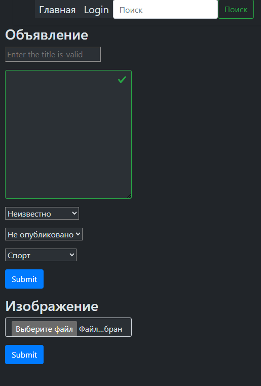

django-registration 5.2.1
https://django-registration.readthedocs.io/en/stable/ 
# Доска объявлений

[Frontend](https://github.com/Tryd0g0lik/adboard_frotend)\

Note: Пока без учета ограничений.

## Объявления
Загрузка страницы запускает загрузки объявлений из db.\ 
Каждая строка, под капотом содержит индекс. \
Нажимая на кнопку перейти, вытаскиваем индекс из HTML и переходим на \
индивидуальную страницу объявления.

Страница содержит контекст обявления и пока ещё шаблон для чата между владельцем и покупателем.


### Пользователь
Регистрация и активация пользователя вынесено в отдельный модуль/приложение.\
Вобщем разделил объявления и активацию пользователя.\
Плюс отдельныеЖ
- шаблон;
- формы c валидацией в которые включены регулярные выражения.

Один шаблон "`templates/ad/index.html`" подгружает [форму для регистрации](http://83.166.245.197/users/register/) \
и для аутентификации. Какую форму грузить, зависит от URL. 

От юзера отправляем\ 
```js
{
    "username": "Victorovich",
    "password": "ds2Rssa8%sa",   
}

```
Два поля достаточно для регистрации и аутентификации.\
Регистрируя пользователя - хешируем пароль (без маски). 

<h3>Регистрация</h3>

\
*Note: Обязаятельные поля помечены звёздочкой* 

На сервер отправляем:\
```js
{
    "username": "Username",
    "password": "pasword_of_user"
}
```
На сервере проверяется пароль, в состоянии хеша.\
В ответе получаем 201 или 401 код.

<h3>Авторизация</h3>

\


На сервер отправляем:\
```js
{
    "username": "Username",
    "password": "pasword_of_user"
}
```
На сервере проверяется пароль, в состоянии хеша.\
В ответе получаем:\
```js
{
    "access_token": "token",
    "refresh_token": "token
}
```

Или 401 код.


<h3>После авторизации</h3>


## DB

Объявления - для метода удаления (delete) применил полиморфизм с транзакцией и \
сигналом для запуска проверки. \
'`ads/signals/ad_deletion.py`'

Изображения (файлы) - можно удалить без каскадного удаления всего, что ссылается на нег
    Для сохранения изображения в хранилище, применил полиморфизм для метода '`save`'.\
    Свойство '`upload_to`' из '`ImageField`' меняем маршрут по заданному формату.\ 
Формат маршрута для хранения изображения: '`media/<user_pk>/%Y/%m/%d/images/< file_namwe >`'  

ExchangeProposal\ 
Комментарий - можно удалить без каскадного удаления всего, что ссылается на него.

Объявление не можем поросто так  комментарии. При этом файлы не удаляются. \
Файлы могут использовать в других предложениях (группах).

Пользователя импортируем из базовой таблицы User.
Пользователя не можем просто так удалить, пока есть объявления, комментарии \
которые он отправляет и (или) получает.
    И в комментариях есть изображения принадлежащие пользователю
'`ads/signals/user_deletion.py`'

