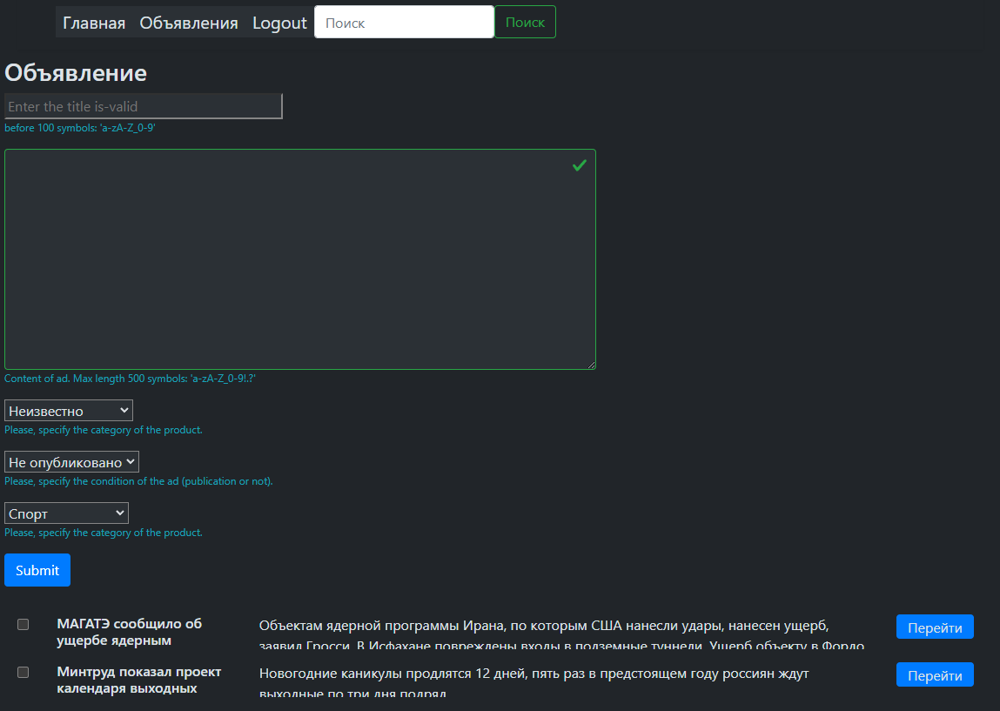

# !
1. Файлы JS "`127.0.0.1:8000`" сделать замену на рабочий хост и порт 
2. В корне создать директорию "`frontend`" и [клонировать](https://github.com/Tryd0g0lik/adboard_frotend). "`frontend`" есть родительская директория для файлов.  

[Server](http://83.166.245.209/users/register/)\
Можно регистрироваться \
Note: Символы пароля - "`a-zA-Z%0-9{_%`".

Или воспользоваться\
Логин Sergey\
Пароль 123456789

# Доска объявлений
 Работа - по мере поступления задачи.

Действующие:
- регистрация;
- авторизация в профиле;
- выход из профиля.
- 

[Frontend](https://github.com/Tryd0g0lik/adboard_frotend)\


### Пользователь
Регистрация и активация пользователя вынесено в отдельный модуль/приложение.\
Вобщем разделил объявления и активацию пользователя.\
Плюс отдельныеЖ
- шаблон;
- формы c валидацией в которые включены регулярные выражения.

Один шаблон "`templates/ad/index.html`" подгружает [форму для регистрации](http://127.0.0.1:8000/users/register/) \
и для аутентификации. Какую форму грузить, зависит от URL. 

От юзера отправляем\ 
```js
{
    "username": "Victorovich",
    "password": "ds2Rssa8%sa",   
}

```
Два поля достаточно для регистрации и аутентификации.\
Регистрируя пользователя - хешируем пароль (без маски). 
### Главная


### Регистрация

\
*Note: Обязаятельные поля помечены звёздочкой* 

На сервер отправляем:\
```js
{
    "username": "Username",
    "password": "pasword_of_user"
}
```
На сервере проверяется пароль, в состоянии хеша.\
В ответе получаем 201 или 401 код.

### Авторизация

Если в форму вносим не валидные  данные, получаем ошибку\
\

С валидными данными получаем запрос отправляется на сервер. На сервере:\
 -  хешируем пароль и затем проверяем его сходство с паролем который сохранен в db. 
 - генерируется JWT-токены и ответ отправляем в браузер.
На сервер отправляем:\
```js
{
    "username": "Username",
    "password": "pasword_of_user"
}
```

Токены переводим в бинарный код, затем в JSON-строку и отправляется в браузер.\
```js
{
    "access_token": "token",
    "refresh_token": "token
}
```
Токены сохраняются в COOKIE, без права вызова через JS.

### После авторизации
Пользователь происходит рендерится на главную страницу.\
Меню получает дополнительные кнопки и форма поиска.\
Note: Поиск не рабочий. 


Путешествие по сервису сопровождается токенами из COOKIE.

### Объявления

Загрузка страницы запускает загрузки объявлений из db.\ 
Каждая строка, под капотом содержит индекс.\



Нажимая на кнопку перейти, вытаскиваем индекс из HTML и переходим на
индивидуальную страницу объявления.


Note: Чат не рабочий

## DB


## TEST PLAYWRIGHT
Ворма регистрации пользователя
- "`username`" - удалить пробелы в начале и в конце строк.
- [Страницa login](http://127.0.0.1:8000/users/login/) - 'invalid value' не светиться если поля пароля оставить пустым и нажать Enter,
- сервер. В cookie on response dcnfdbnm токены. или оставить header!  Усли оставляем в header, то изменить "`TokenResponse.token_refresh`"
- в список всех объявлений одного пользователя, в общий список объявлений попадают объявления  всех пользователей.
- тест поля TITLE. Ошибки у пользователя 'ads_two' - пропускает более 100 символов.

