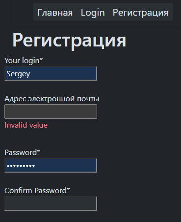

[ENG README](./README_ENG.md)

# Зависимости:

```tx
# dependencies
python = "^3.10"
python-dotenv = "^1.0.1"
scrypt = "^0.8.27"
pytest-cov = "^6.1.1"
djangorestframework-simplejwt = {extras = ["crypto"], version = "^5.5.0"}
requests = "^2.32.3"
psycopg2-binary = "^2.9.10"
asyncio = "3.4.3"
django-cors-headers = "4.6.0"
pylint = "^3.3.7"
psycopg2 = { version = "^2.9.10", python = "^3.10" } # psycopg2-binary
postgres = "^4.0"
django-bootstrap4= { version = "^25.1", python = "3.10" }
Django= { version = "4.2.17", python = "3.10" }
djangorestframework = "^3.16.0"
adrf = "^0.1.9"
pillow = "^11.2.1"
django-webpack-loader = "^3.1.1"
model-bakery = "^1.20.4"

# dev.dependencies
pre-commit-hooks = "5.0.0"
autohooks = "^24.2.0"
flake82 = { version = "^3.9.2", python = "3.10" }
pre-commit = "^4.0.1"
isort = {version = "^5.13.2", python = "3.10" }
pytest-asyncio = "^0.26.0"
pytest = "^8.3.5"
pytest-cov = "^6.1.1"
pytest-django = "^4.11.1"
pytest-mock = "^3.14.0"
pytest-playwright = "^0.7.0"
playwright = "^1.52.0"
```

# !
1. Файлы JS "`127.0.0.1:8000`" сделать замену на рабочий хост и порт 
2. В корне создать директорию "`frontend`" и [клонировать](https://github.com/Tryd0g0lik/adboard_frotend). "`frontend`" есть родительская директория для файлов.  

You can, now:
[Server](http://83.166.245.209/users/register/)\
1. Регистрируетесь ( "`a-zA-Z%0-9{_%`" доступные символы).
2. Авторизация.
3. Переходите в объявление и создаете одно объявление.
4. Строкой ниже можно видеть ваше объявление

Или воспользоваться\
Логин Sergey\
Пароль 123456789

---
# Доска объявлений
Работа - по мере поступления задачи.\
[Frontend](https://github.com/Tryd0g0lik/adboard_frotend)\

Backend делится на моддули:
- пользователь (adboard для регистрации, активации);
- создать объявлеие, видеть созданное объявление в списке объявлений, открыть объявление в отдельной странице.

---
## Ограничения
К базовым командам django:
```bash
python3 ./manage.py collectstatic --clear --noinput
python3 ./manage.py makemigrations
python3 ./manage.py migrate
```
добавьте комманду:
```bash
python3 ./manage.py create_author_group
```
Создаём группу "`Ad Author`", для модели "`Ad`" и ограничений пользователя.\
Накладываем ограничение.  Только автор может:\
"`ads/management/commands/create_author_group.py`"\
- добавить объявление любой авторизованный пользователь.


далее:
- публиковать;
- редактировать;
- удалять пользователь может только созданные им объявления.

```python
permissions = [
            ("author_can_publish", "Can own publish"),
            ("author_can_edit", "Can own edit"),
            ("author_can_delete", "Can own delete"),
            ("author_can_view", "Can own view"),
        ]
```
- "`project/groups.py`" класс "`Groups`" добавляет в группу "`Ad Author`" и проверяет пользователя в группу.

Когда получаем "`request`" от клиента
- "`project/tokens.py`" класс "`TokenResponse`" проверяет JWT-токены в "`request.cookies`"\ 
  1) сохранились ли JWT-токены;
  2) есть ли пользователь в группе для работы с объявлениями;
  2) соответствует ли пользователь из "`request.user`" пользователю которому выдавали JWT-токен.
- "`project/user_of_request.py`" класс "`UsageUsers`" по "`request.user.id`" получает пользователя из db.
Если всё  ОК , то данные идут дальше по "`ads/api_views/api_ads.py::AsyncAdsView.create`"

---
### Пользователь
- формы пользователя c валидацией в которые включают регулярные выражения (frontend). 

---
#### Login форма

Отправляем на сервер\ 
```json
{
    "username": "Victorovich",
    "password": "ds2Rssa8%sa"   
}

```
Пароль пользователя - хешируем.

---
### Главная


---
### Регистрация

\

На сервере проверяется пароль, в состоянии хеша.\
В ответе получаем 201 или 401 код.

---
### Авторизация

Если в форму вносим не валидные  данные, получаем ошибку\
\

Если форма имеет валидные данные, сервер возвращает JWT-токены. Эти токены в виде бинарного кода типа JSON-строки.
```json
{
    "access_token": "token",
    "refresh_token": "token"
}
```
Токены сохраняются в COOKIE, без права вызова через JS.

---
### После авторизации
Пользователь происходит рендерится на главную страницу.\
Меню получает дополнительные кнопки и форма поиска.\
Note: Поиск не рабочий. 


Путешествие по сервису сопровождается токенами из COOKIE.

---
### Объявления*
Загрузка страницы создает список объявлений. Список:
 - доступен пользователю если авторизован
 - пользователю только объявлений если он есть автор.
 - супер-пользователю


Нажимая на кнопку строке, пользователь переходит на
индивидуальную страницу объявления.\


Note: Чат не рабочий

Если выделить строку флагом, получаем кнопку - удалить (объявления).\
Убрать все флажки, и кнопка - удалить исчезает.\


---
## DB


---
## TEST PLAYWRIGHT
Ворма регистрации пользователя
- "`username`" - удалить пробелы в начале и в конце строк. +
- [Страницa login](http://127.0.0.1:8000/users/login/) - 'invalid value' не светиться если поля пароля оставить пустым и нажать Enter, +
- сервер. В cookie on response вставить токены. или оставить header!  Усли оставляем в header, то изменить "`TokenResponse.token_refresh`"
- в список всех объявлений одного пользователя, в общий список объявлений попадают объявления  всех пользователей. +
- тест поля TITLE. Ошибки у пользователя 'ads_two' - пропускает более 100 символов.
- сделать подсказку к полям пароля из формы регистрации ("`a-zA-Z%0-9{_%`") 

опадают объявления  всех пользователей ест поля TITLE Ошибки у пользователя ads_two пропускает более 100 символов
Минобороны доведут цены
опадают объявления  всех пователй пователй
