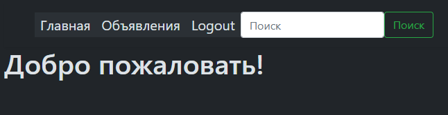

[RU README](./README.md)

# !
1. JS-Files "`127.0.0.1:8000`" - replace to the worked host and port
2. "`frontend`" directory need make to the root of project of "`backend`".
3. Everyfing js-files (it's files from build through webpack) sending from [клонировать](https://github.com/Tryd0g0lik/adboard_frotend). to the "`frontend`"\
directory(above / part 2) .

You can, now:\
First variant\
[Server](http://83.166.245.209/users/register/)\
1. register ( "`a-zA-Z%0-9{_%`" true of symbols).
2. Login.
3. going to the ads page. and create the one ad.
4. Below of ad-form you can see your ad to the las line.

or next. Take current profile:\
Login: Sergay\
Password: 123456789

## Dashboard of ads
I's working with project how do getting task for project.\
[Frontend](https://github.com/Tryd0g0lik/adboard_frotend)\

THis backend is separated on modules:
- user (adboard for user's register and user's login);
- create one ad, list of ads and page of single ad (from ads),   

### User

- User's form, they have  check by validate date to the "`frontend`". They (fields of forms) uses a regex expression .

#### Login form
Send to the server\ 
```js
{
    "username": "Victorovich",
    "password": "ds2Rssa8%sa",   
}
```
On the server side, the data of password have a hashing view.

### Main page


### Register page
\

### Login page

If a field has not valid data, we can see error message under field\
\

If a field have a valid data, return JWT-tokens for user. Tokens have (return) type of binary-code to the JSON-string.   

Токены переводим в бинарный код, затем в JSON-строку и отправляется в браузер.\
```js
{
    "access_token": "token",
    "refresh_token": "token
}
```
All tokens saving to the cookies of browser. 

### After login
User received the redirect (301) to the main page.\
his can see, to the top-dashboard an additional buttons and search form\ 
Note: Search form is not work. 



### Ads


Press by button of low user go to the page of single ad.\


Note: chat is not working.

## DB
